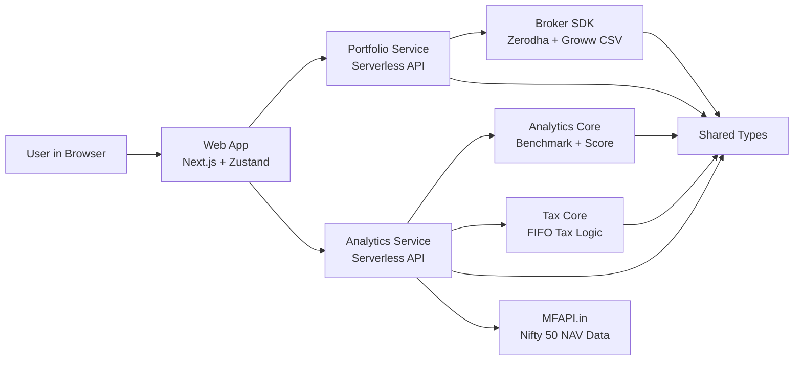

# Portfolio Analyzer

AI Portfolio Analytics Platform for Indian investors.

## Purpose

This monorepo provides a lean MVP that helps users:
- import portfolio holdings from brokers
- compare portfolio performance vs Nifty 50 benchmark
- view tax signals (LTCG/STCG and harvesting view)
- understand overall portfolio health score

## High-Level Architecture



## Monorepo Structure

- apps/web: Frontend dashboard and tax UI
- apps/portfolio-service: Portfolio import and holdings APIs
- apps/analytics-service: Benchmark, score, and tax APIs
- packages/shared-types: Shared TypeScript contracts across apps/services
- packages/broker-sdk: Broker adapters (Zerodha API, Groww CSV parser)
- packages/analytics-core: Benchmark and portfolio score logic
- packages/tax-core: Deterministic FIFO tax logic
- infrastructure: Infra placeholder for Terraform and deployment assets

## Service Ownership

### 1) Web App

Primary responsibility:
- user interface and state orchestration

Owns:
- dashboard widgets and charts
- tax screen visualization
- CSV upload interaction
- calling backend APIs and handling fallback states

Does not own:
- financial calculations
- tax logic
- broker normalization logic

### 2) Portfolio Service

Primary responsibility:
- ingest and expose holdings data

Owns:
- holdings retrieval endpoint
- Groww CSV import endpoint
- portfolio summary endpoint
- broker adapter invocation for holdings data

Does not own:
- benchmark comparisons
- scoring model
- tax calculations

### 3) Analytics Service

Primary responsibility:
- compute analytics from portfolio context

Owns:
- benchmark comparison endpoint
- portfolio health score endpoint
- tax summary endpoint
- MFAPI integration for Nifty 50 NAV history

Does not own:
- broker import ingestion
- frontend presentation

## Package Responsibilities

### shared-types
- source of truth for cross-service data contracts
- minimizes drift between frontend and backend payloads

### broker-sdk
- normalizes broker-specific response formats
- includes Groww CSV parser for MVP import path
- includes Zerodha holdings adapter

### analytics-core
- benchmark math and alpha computation
- portfolio health score calculation
- independent of transport or framework details

### tax-core
- deterministic FIFO lot matching
- realized tax summary primitives
- pure computation package (no API/web concerns)

## API Surface (Current)

Portfolio Service:
- GET /portfolio/holdings
- POST /portfolio/import
- GET /portfolio/summary

Analytics Service:
- GET /analytics/benchmark
- GET /analytics/score
- GET /analytics/tax

## Runtime and Data Flow Notes

- Web app requests holdings and summary from portfolio-service.
- Web app requests benchmark, score, and tax from analytics-service.
- Analytics benchmark endpoint uses MFAPI NAV history.
- In MVP local mode, portfolio-service currently keeps imported holdings in memory for simplicity.

## Local Development

From repo root:

```bash
pnpm install
pnpm -r build
```

Run services:

```bash
cd apps/portfolio-service && pnpm dev
cd apps/analytics-service && pnpm dev
```

Run web app:

```bash
cd apps/web && pnpm dev
```

## Design Principle

Keep business logic in packages, transport logic in services, and presentation logic in the web app.
This separation allows independent iteration on UI, broker ingestion, and calculation engines.
